## Instalación de Servicio con Docker
En este README se explicará brevemente a través de la linea de comandos como instalar la imagen de Alpine, crear distintos contenedores que corran dicha imagen y probar la conexión entre ellas con la herramienta Docker.


## Índice

* [Descripción General](#Instalación-de-Servicio-con-Docker)

* [Descarga e Instalación de la imagen de "Alpine"](#Descarga-e-Instalación-de-la-imagen-de-"Alpine")

* [Creación de contenedor con Alpine](#Creación-de-contenedor-con-Alpine)

* [Creación de Contenedor Alpine con nombre](#Creación-de-Contenedor-Alpine-con-nombre)

* [Pruebas de conexión](#Pruebas-de-conexión)

* [Creación de contenedor "dam_alp2" y conexión entre contenedores](#Creación-de-contenedor-"dam_alp2"-y-conexión-entre-contenedores)

* [Propiedades y Características de las Imagenes y Contenedores](#Propiedades-y-Características-de-las-Imagenes-y-Contenedores)

* [Contacto](#Contacto)

* [Documentación](#Documentación)


## Descarga e Instalación de la imagen de "Alpine"

Para comenzar tendremos que instalar la imagen de la distribución de Linux Alpine, para esto utilizaremos el comando:
    
```bash
docker pull alpine
```
<br><br>
Aquí una captura de pantalla de como debería verse la terminal mientras descargamos la imagen:

 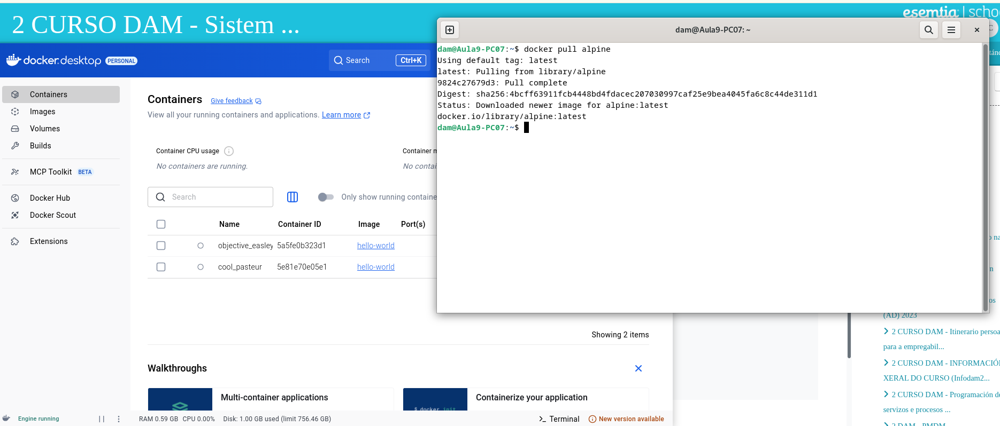

Para saber si la imagen se instaló correctamente en nuestro equipo se utiliza el siguiente comando:
    
```bash
docker images
```
<br><br>
Aquí una captura de pantalla:

 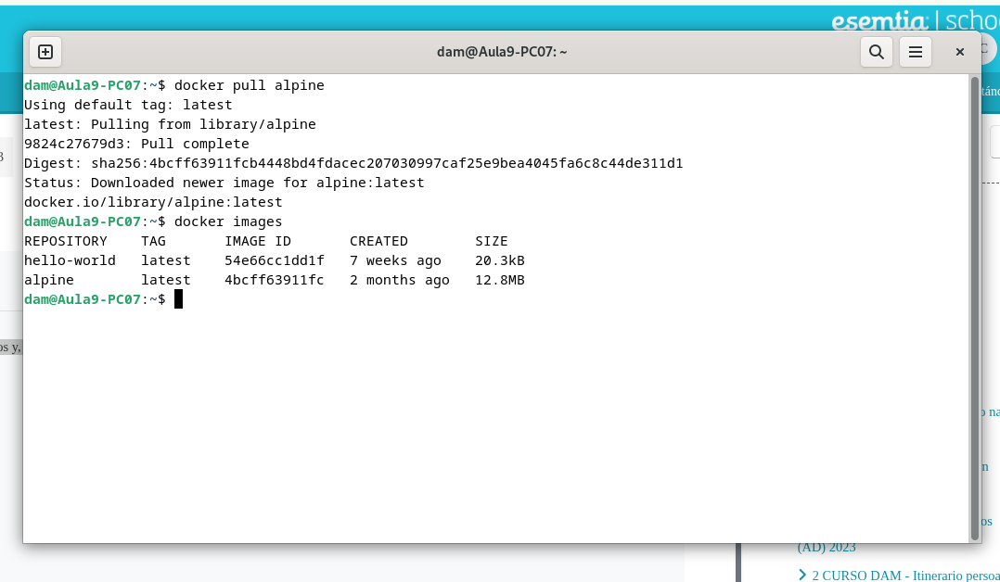

<br><br>
## Creación de contenedor con Alpine
Para crear el contenedor de Alpine sin nombre utilizamos el comando:

```bash
docker run -it alpine
```

<br><br>
Captura de pantalla de como se ve el comando en la terminal:

 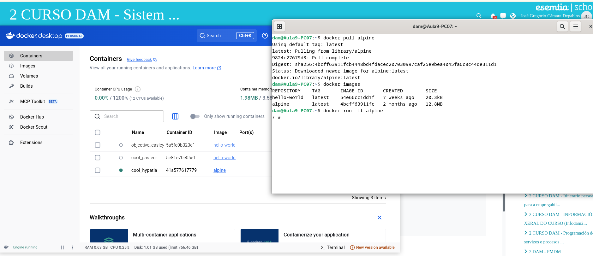
 <br><br>
Como podemos observar en la foto, el contenedor arranca automaticamente.

<br><br>
Para averiguar cual es el nombre del contenedor que se creó utilizamos el comando:

```bash
docker ps -a
```

Esto nos muestra todos los contenedores creados con sus respectivas imagenes, y su estatus actual ya sea que esten corriendo o apagados.
En este ejemplo el contener de alpine se llama "cool_hypatia"
<br><br>
Captura de pantalla de como se ve la terminal con el comando:
 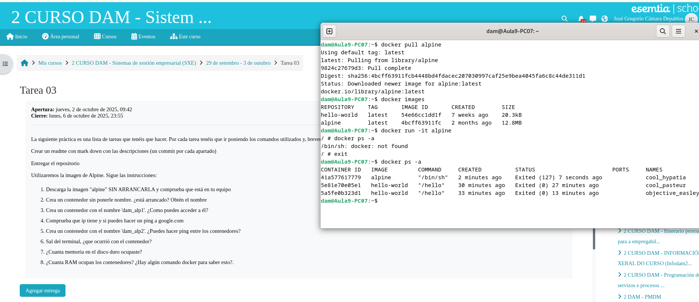
 <br><br>

 ## Creación de Contenedor Alpine con nombre

Se creará el contenedor "dam_alp1" con el siguiente comando:

```bash
docker container create -i -t --name dam_alp1 alpine
```
<br><br>
Captura de pantalla de la vista desde terminal del comando:
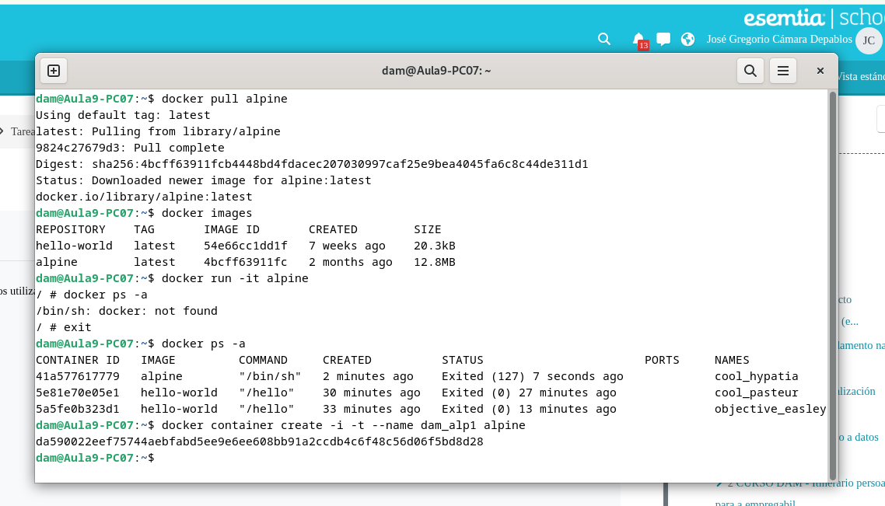

<br><br>
Para iniciar el contenedor utilizamos el siguiente comando:

```bash
docker container start --attach -i dam_alp1
```
<br><br>

Captura de pantalla de la maquina virtual funcionando desde terminal:
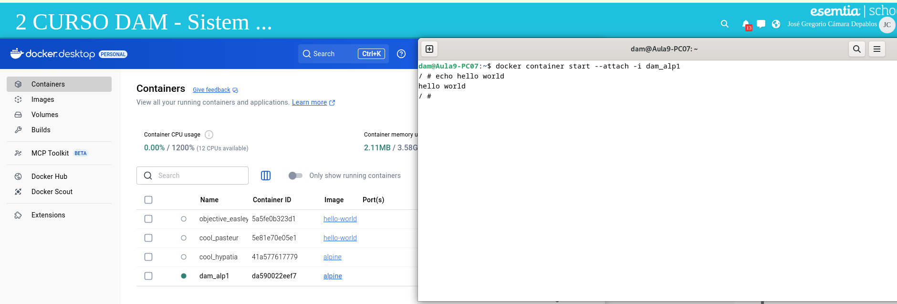

<br><br>

## Pruebas de conexión 

Para averiguar el ping que tiene asignado el contenedor de Alpine se utilizará el siguiente comando dentro de la maquina virtual:

```bash
ip addr
```
<br><br>
- Captura de pantalla de el resultado de el comando por terminal:

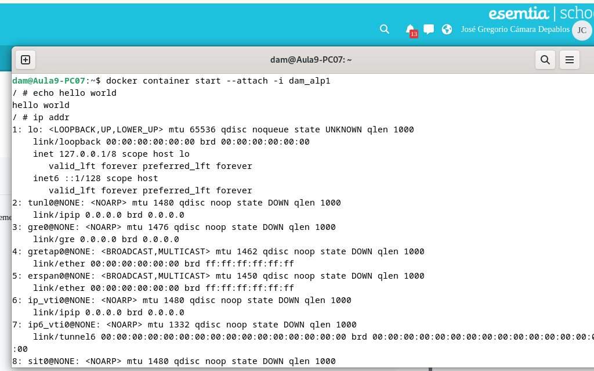
<br><br>
Como podemos ver en la imagen, el ping del equipo virtual es: 127.0.0.1.

<br><br>
Para realizar un ping a Google utilizaremos el siguiente comando desde la terminal de el Alpine activo:

```bash
ping -c 4 google.com
```
Captura de pantalla mostrando la respuesta del ping:

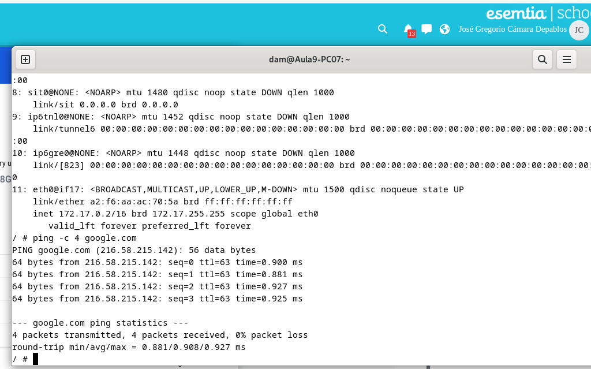
<br><br>

## Creación de contenedor "dam_alp2" y conexión entre contenedores

Para crear el segundo contenedor utilizaremos el siguiente comando:

```bash
docker run -it --name dam_alp2 alpine
```
<br><br>

A diferencia de "docker create", "docker run" crea el contenedor y lo inicializa automaticamente.

<br><br>

Captura de pantalla mostrando la creación del contenedor:

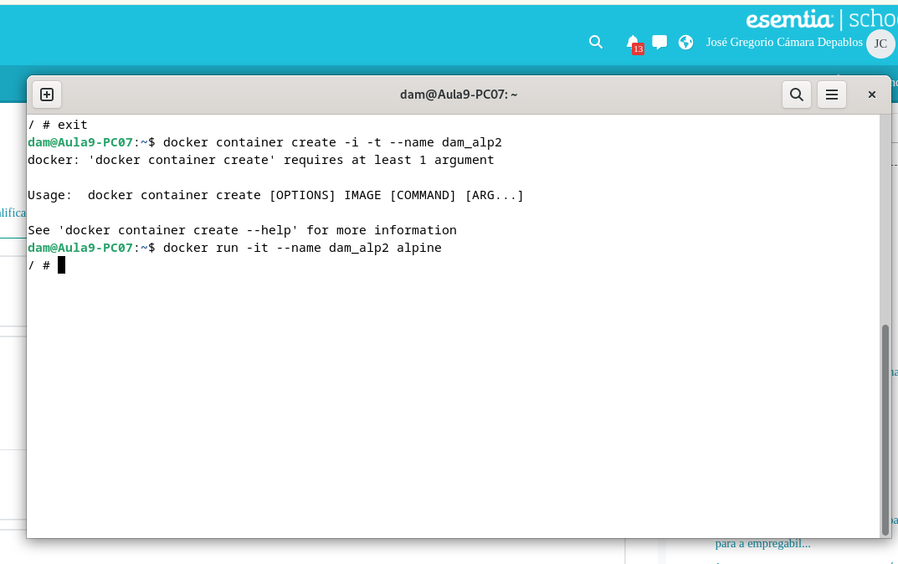
<br><br>

Iniciamos ambos contenedores en distintos terminales, como se puede ver en la siguiente captura de pantalla:

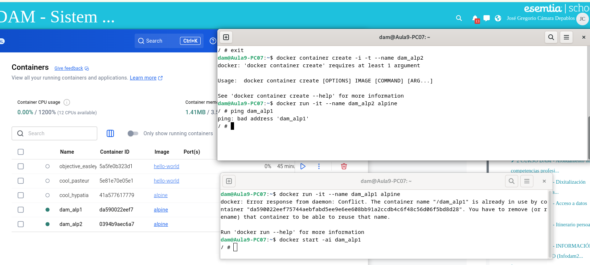
<br><br>

Utilizamos el comando ping de una maquina a la otra para probar la conexión interna:

```bash
ping <aqui va la dirección ip de la maquina a la que quieres conectar>
```
<br><br>

para saber la dirección ip de la maquina a conectar utilizaremos el comando:

```bash
ip addr
```
<br><br>

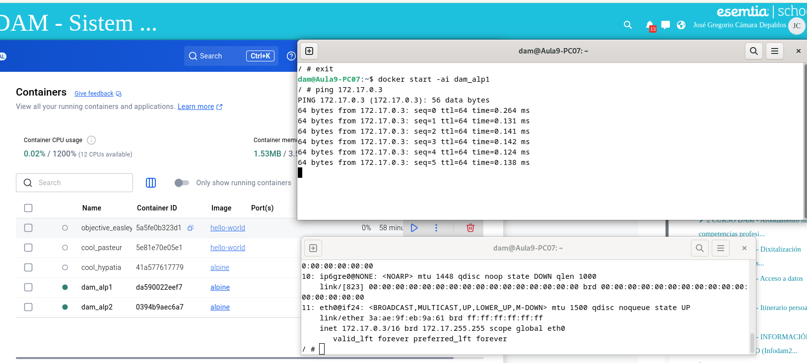
<br><br>

## Propiedades y Características de las Imagenes y Contenedores

-  Al cerrar el terminal con el comando "exit" se cierra la maquina de Alpine del terminal de la maquina que hayas cerrado, la otra maquina sigue operativa como se puede ver en la siguiente captura de pantalla:
<br><br>

Captura de pantalla:
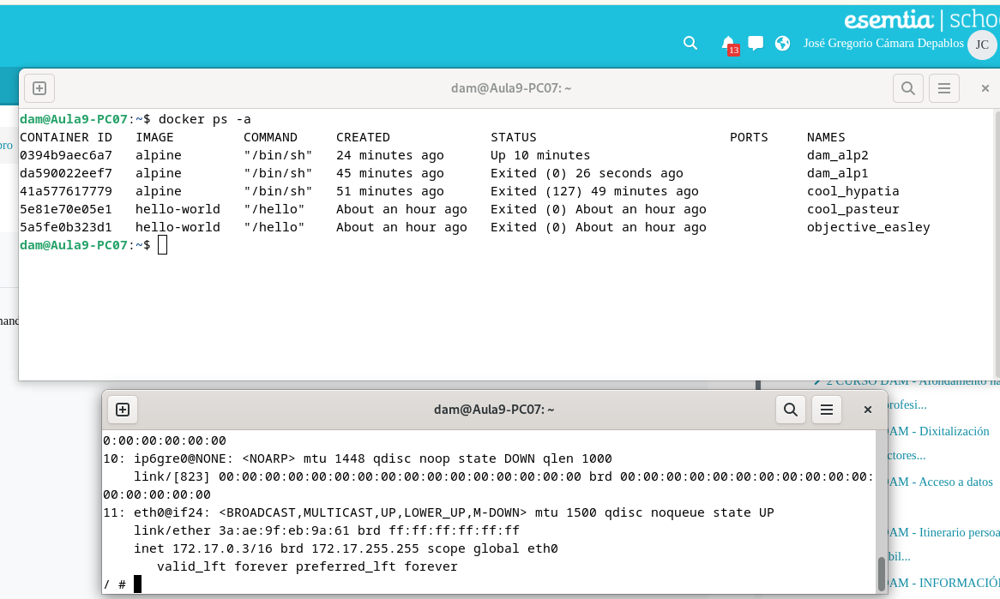
<br><br>

Como se puede ver en la imagen, la máquina "dam_alp1" fue cerrada hace 26 segundos mientras que la máquina "dam_alp2" lleva corriendo 10 minutos.
<br><br>

Para conocer el espacio en memoria local que ocupan las imágenes y contenedores utilizamos el siguiente comando:
```bash
docker system df
```
<br><br>

Captura de pantalla:
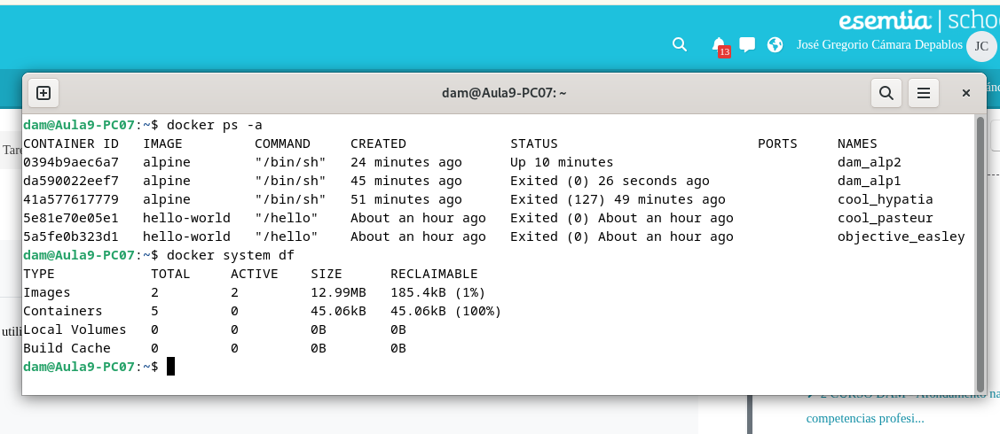
<br><br>

Podemos observer que las dos imagenes que tiene nuestro equipo hasta el momento ocupan un total de 12.99MB mientras que los contenedores, que son 5 hasta el momento, ocupan un total de 45.06KB.
<br><br>

- El comando que utilizaremos para saber el uso de RAM de los contenedores en marcha es:

```bash
docker stats
```
<br><br>

Captura de pantalla:
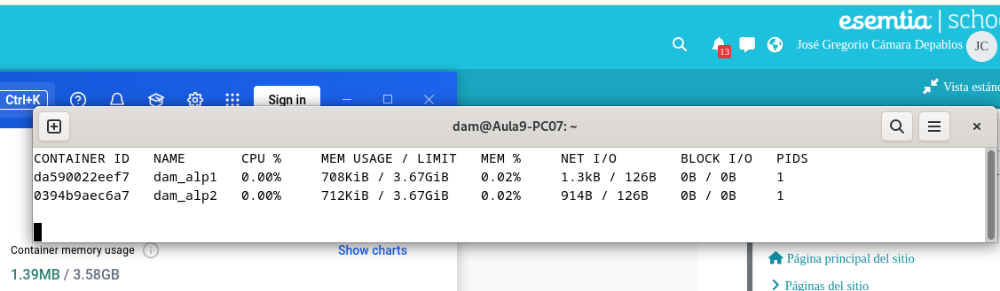
<br><br>


## Contacto
José Gregorio Cámara Depablos - [@CabbaGG](https://x.com/Geek_Cabagge) - JOS.95camara@gmail.com

Project Link: ([Instalación de Servicio con Docker](https://github.com/CabbaGG2/SXE_Tarea3))

## Documentación

* [Docker Tutorial: Get Going From Scratch](https://stackify.com/docker-tutorial/)
* [Documentación de Docker](https://docs.docker.com/get-started/)


